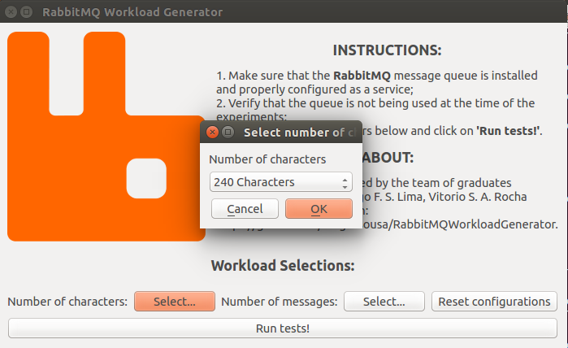
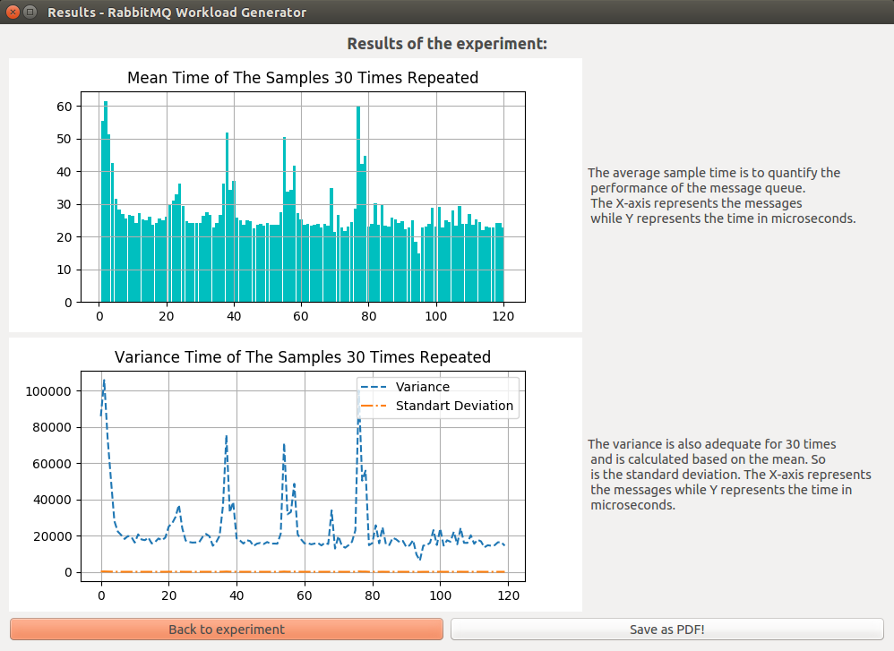
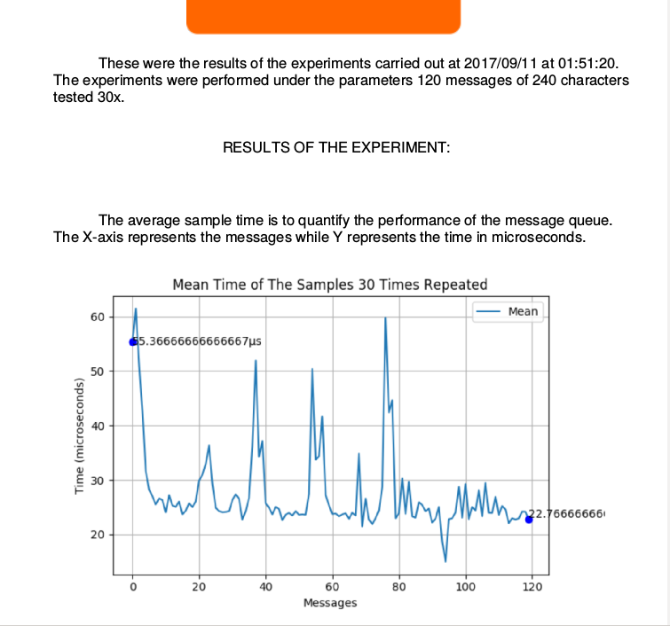

# RabbitMQWorkloadGenerator

> This is a workload generator for the RabbitMQ message queue.

## Step by Step to Install:

First of all, have pip and virtualenv installed.

1. Make sure you have RabbitMQ installed on your machine. If you do not have it you can add it on http://www.rabbitmq.com/

2. Create a virtualenv for the project by prescribing Python 3:<br>
```virtualenv --python = python3 [environment name]```

3. Enter the virtualenv folder and activate it:<br>
```source bin/activate```

4. Make the clone or download the project into the part of the newly created virtualenv.

5. In the virtualenv root create a "build" folder, download the SIP and PyQt4 modules. Once done, extract them into the folder:<br>
PyQt4: https://www.riverbankcomputing.com/software/pyqt/download<br>
SIP: https://www.riverbankcomputing.com/software/sip/download<br>

6. Install some prerequisites:<br>
```sudo apt-get install python3-dev libxext-dev python-qt4 qt4-dev-tools build-essential```

7. Go to "build/<SIP folder>" directory:<br>
```python configure.py``` <br>
```make``` <br>
```sudo make install```

8. Go to "build/<PyQt4 folder>" directory:<br>
```python configure.py``` <br>
```make``` <br>
```sudo make install```

9. Enter the "app" folder and install pip dependencies:<br>
```pip install -r requirements.txt .```

10. Still in the app folder run ```python view.py```

## How to use:

After running the ```python view.py``` command on the terminal, the application will start an interface. Select the workload and go to "run tests!".


<p align="center">
  
</p>

The app will ask you if you want to see results from the experiment. Upon confirmation, the graphs of mean, variance and standard deviation of the samples will be displayed on the screen.

<p align="center">
  
</p>

You can also save this in a PDF.

<p align="center">
  
</p>